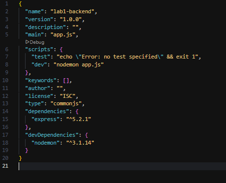
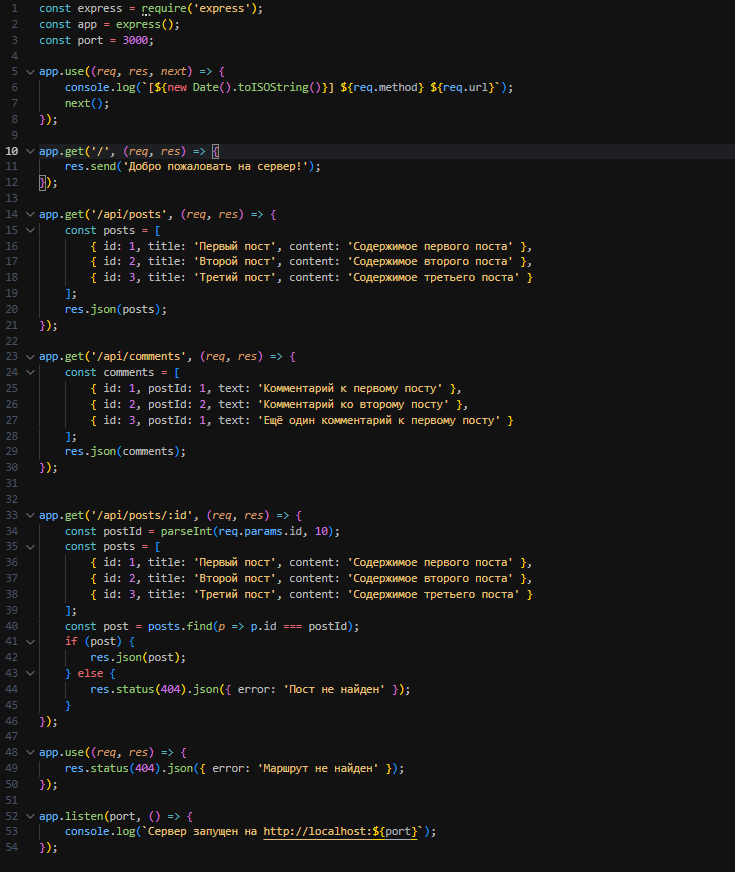

# Лабораторная работа №1: Настройка среды разработки и первый HTTP-сервер

**Студент:** Ванян Давид

**Группа:** ПИЖ-б-о-25-2

**Вариант:** 8

**Технология:** Node.js+express

---

## Содержание
- [Цель работы](#цель-работы)
- [Теоретическое обоснование](#теоретическое-обоснование)
- [Выполнение индивидуального задания](#выполнение-индивидуального-задания)
- [Контрольные вопросы](#контрольные-вопросы)
- [Вывод](#вывод)

---

<a id="цель-работы"></a>
## Цель работы
Освоить установку инструментов для бэкенд-разработки, создать и запустить минимальный веб-сервер, обрабатывающий GET-запросы, понять концепцию эндпоинтов, научиться настраивать автоматический перезапуск сервера.

<a id="теоретическое-обоснование"></a>
## Теоретическое обоснование
Бэкенд (backend) — это серверная часть веб-приложения, которая отвечает за обработку запросов от клиентов, взаимодействие с базами данных, выполнение бизнес-логики и формирование ответов. Бэкенд работает на сервере и не виден пользователю напрямую.

<a id="выполнение-индивидуального-задания"></a>
## Выполнение индивидуального задания

**Шаг 1.** Создаём проект, устанавливаем точку входа `app.js` в `package.json`. Устанавливаем скрипт `"dev": "nodemon app.js"`.

**Шаг 2.** Создаём файл с сервером и подключаем Express. Добавляем вывод в консоль времени, URL и метода запроса.

**Шаг 3.** Добавляем 5 эндпоинтов (1 текстовый, 2 JSON, 1 JSON с параметром и 1 обработчик ошибок 404)

**Шаг 4.** Тестируем проект.

<a id="контрольные-вопросы"></a>
## Контрольные вопросы

1. Что такое клиент-серверная архитектура?  
2. Какой протокол используется для общения клиента и сервера в вебе?  
3. Что такое эндпоинт?  
4. Какую структуру имеет HTTP-запрос и HTTP-ответ? Что такое код состояния?  
5. Что такое JSON? Почему он популярен?  
6. Как запустить сервер на Node.js?  
7. Что такое автоматический перезапуск и зачем он нужен? Какой пакет используется в Node.js?  
8. Какие коды состояния HTTP вы знаете? За что отвечает код 404?  
9. Что такое middleware в Express?  
10. Как получить параметр из URL-пути (например, ID) в Express?

<a id="вывод"></a>
## Вывод
В ходе выполнения лабораторной работы был разработан сервер на платформе Node.js с использованием фреймворка Express. Реализовано клиент-серверное взаимодействие по протоколу HTTP, созданы 5 эндпоинтов согласно варианту №8 (сущности `posts` и `comments`), включая текстовый, два JSON-эндпоинта, параметризованный маршрут с идентификатором и обработчик ошибки 404. Организовано автоматическое логирование всех входящих запросов с выводом метода, URL и времени в консоль. Настроен автоматический перезапуск сервера с помощью пакета `nodemon`, что ускоряет процесс разработки.

---

## Код сервера
```javascript
const express = require('express');
const app = express();
const port = 3000;

app.use((req, res, next) => {
    console.log(`[${new Date().toISOString()}] ${req.method} ${req.url}`);
    next(); 
});


app.get('/', (req, res) => {
    res.send('Добро пожаловать на сервер!');
});


app.get('/api/posts', (req, res) => {
    const posts = [
        { id: 1, title: 'Первый пост', content: 'Содержимое первого поста' },
        { id: 2, title: 'Второй пост', content: 'Содержимое второго поста' },
        { id: 3, title: 'Третий пост', content: 'Содержимое третьего поста' }
    ];
    res.json(posts);
});

app.get('/api/comments', (req, res) => {
    const comments = [
        { id: 1, postId: 1, text: 'Комментарий к первому посту' },
        { id: 2, postId: 2, text: 'Комментарий ко второму посту' },
        { id: 3, postId: 1, text: 'Ещё один комментарий к первому посту' }
    ];
    res.json(comments);
});


app.get('/api/posts/:id', (req, res) => {
    const postId = parseInt(req.params.id, 10);
    const posts = [
        { id: 1, title: 'Первый пост', content: 'Содержимое первого поста' },
        { id: 2, title: 'Второй пост', content: 'Содержимое второго поста' },
        { id: 3, title: 'Третий пост', content: 'Содержимое третьего поста' }
    ];
    const post = posts.find(p => p.id === postId);
    if (post) {
        res.json(post);
    } else {
        res.status(404).json({ error: 'Пост не найден' });
    }
});

app.use((req, res) => {
    res.status(404).json({ error: 'Маршрут не найден' });
});


app.listen(port, () => {
    console.log(`Сервер запущен на http://localhost:${port}`);
});
```

---

## Рекомендуемые источники
1. **Node.js официальная документация** — https://nodejs.org/en/docs/
2. **Express официальная документация** — https://expressjs.com/
3. **Flask официальная документация** — https://flask.palletsprojects.com/
4. **HTTP протокол (MDN)** — https://developer.mozilla.org/ru/docs/Web/HTTP
5. **JSON (MDN)** —
https://developer.mozilla.org/ru/docs/Web/JavaScript/Reference/Global_Objects/JS
ON
6. **Nodemon документация** — https://nodemon.io/
7. **Postman документация** — https://learning.postman.com/docs/gettingstarted/introduction/
8. **REST API — основные принципы (GeeksforGeeks)** —
https://www.geeksforgeeks.org/node-js/explain-the-concept-of-restful-apis-inexpress